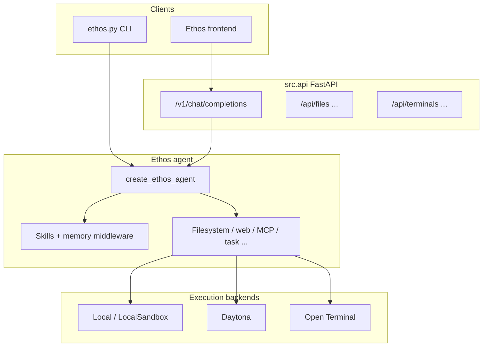

# Ethos

**Ethos** is an AI agent framework built on **LangGraph** and **LangChain**. It runs tools inside **sandboxed** environments (local, subprocess, Daytona, Open Terminal) and exposes an **OpenAI-compatible** HTTP API. The primary UI is the **Vite + React app** in [`frontend/`](frontend/) (CLI and any other HTTP client can use the same API).

**This project implements a harness agent**: a single, deployable stack where orchestration, tools, execution backends, middleware, and the API surface ship together—not a thin wrapper around a single chat completion call.

---

## Features

- **LangGraph agent** (`create_ethos_agent`) with conversational checkpointing (`MemorySaver`).
- **Tools**: filesystem (read, write, edit, glob, grep, notebook), web (Tavily, fetch), todos, task / subagents, MCP, shell (when using a sandbox backend), and more.
- **Middleware**: workspace skills under `workspace/skills`, persistent context via `workspace/AGENTS.md`.
- **Execution backends**: local (pathlib), LocalSandbox (subprocess in the workspace), **Daytona**, **Open Terminal** (HTTP).
- **FastAPI server** (`python main.py`): OpenAI-compatible `/v1/models` and `/v1/chat/completions`, with streaming `delta.content` and `delta.reasoning_content` (thinking / tool status).
- **Web UI** (`frontend/`): Ethos chat and settings; configure `VITE_API_BASE_URL` to point at the API (default in Compose: `http://localhost:8080`).
- **Docker Compose**: API, Open Terminal, and **ethos-frontend**—see `docker-compose.yml`.

---

## Architecture (overview)



---

## Requirements

- Python **≥ 3.11**
- [uv](https://github.com/astral-sh/uv) (recommended) or `pip`

---

## Quick setup

```bash
uv sync --all-groups
cp .env.example .env
# Edit .env: OPENROUTER_API_KEY / ANTHROPIC_API_KEY / OPENAI_API_KEY (per provider)
```

---

## Run the agent

**CLI** (default: local; add sandboxing or remote backends as needed):

```bash
python ethos.py
python ethos.py --sandbox
python ethos.py --daytona
python ethos.py --open-terminal
```

**API server** (port **8080**):

```bash
python main.py
```

**LangGraph dev** (LangGraph Studio graph endpoint):

```bash
langgraph dev
```

Graph entrypoint: `langgraph.json` → `./src/graph.py:create_ethos_agent`.

---

## Full stack (Docker)

```bash
# Linux / macOS
./start-dev.sh

# Windows
start-dev.bat
```

Typical ports: API **8080**, Open Terminal **8000**, Ethos frontend **3000** (`docker-compose.yml`).

---

## Frontend (local dev)

With the API running (`python main.py` on port 8080):

```bash
cd frontend
npm install
npm run dev
```

Set `VITE_API_BASE_URL` if the API is not on the default used by Vite (see `frontend` env and `docker-compose.yml`).

---

## Deploy v1

Recommended hosted deployment for the current codebase:

- **Backend**: Render Web Service
- **Frontend**: Vercel

See [`docs/DEPLOY_RENDER_VERCEL.md`](docs/DEPLOY_RENDER_VERCEL.md) for the full step-by-step guide, required environment variables, health checks, and the current user API key behavior.

---

## Tests

```bash
uv run pytest
```

---

## Repository layout

| Path | Role |
|------|------|
| `src/ai/agents/ethos.py` | Main agent factory |
| `src/backends/` | Local, Daytona, Open Terminal, sandbox base |
| `src/ai/tools/` | Agent tools |
| `src/ai/middleware/` | Skills, `AGENTS.md` memory |
| `src/app/` | FastAPI app, modules, dependencies, services |
| `ethos.py` | CLI entry |
| `main.py` | API server entry |
| `frontend/` | Vite + React UI |
| `tests/` | Pytest suite |

More detail for contributors: `CLAUDE.md`.

---

## Contributing

Issues and pull requests are welcome.
